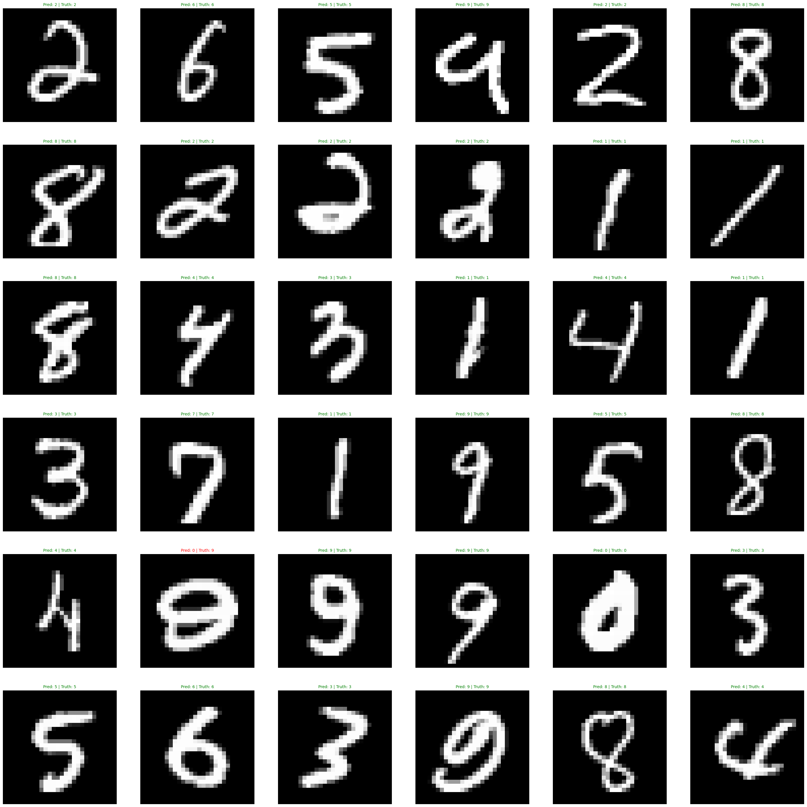

# Handwritten digit classification with Pytorch

This project uses the [MNIST dataset](http://yann.lecun.com/exdb/mnist/) for training. It has a total of `70000` handwritten digits split into train set and test set of `60000` and `10000` images respectively. The images are __28x28 pixelated grayscale images__ of single handwritten digits between 0 and 9.

The objective of this project is to classify a given image of handwritten digit into a integer from 0 to 9.

## Results:
> || Train Accuracy | Test Accuracy |
> | :- | -: | -: |
> | Training | 99.13% | 98.45% |
